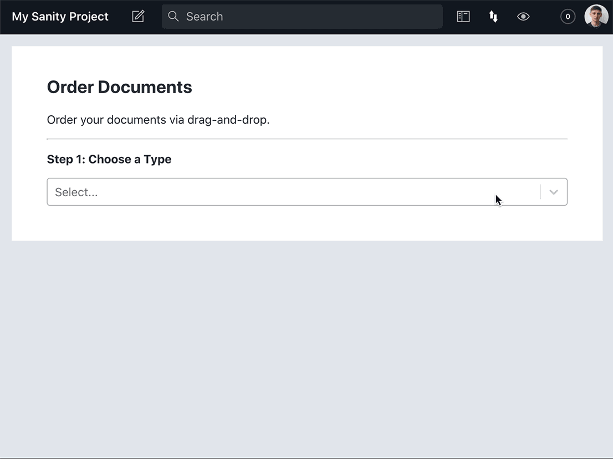

# sanity-plugin-order-documents

Order your Sanity documents via drag-and-drop.



## Installation

To install the plugin, navigate to the root directory of your Sanity Studio project and run:

```sh
sanity install order-documents
```

Then, open `sanity.json` and append "order-documents" to the `"plugins"` array:

```json
"plugins": [
  "order-documents"
],
```

Now, when you run `sanity start`, you should see the "Order Documents" tab in the top navigation bar.

## Usage

To save a custom order, you'll need to add a hidden `order` field inside the schema file of any document type you want to order.

For example, to add `order` to the "movie" type, go into `./schemas/movie.js` and add:

```js
fields: [
  // other fields,
  {
    name: "order",
    title: "Order",
    type: "number",
    hidden: true,
  },
],
```

Now, when we query our dataset, we can order the results according to the `order` property. New documents will be added to the top of the list.

### Querying with GROQ

To query movies using Sanity's query language GROQ, we can write:

```groq
*[_type == "movie"] | order(order asc)
```

Our custom order has been saved, and it will be reflected in the result!

There are a lot more GROQ examples in [Sanity's GROQ query cheat sheet](https://www.sanity.io/docs/query-cheat-sheet).

### Querying with GraphQL

Alternatively, using `gen2` or `gen3` of Sanity's GraphQL API, we can write:

```graphql
query {
  allMovie(sort: [{ order: ASC }]) {
    _id
    title
    order
    # more fields
  }
}
```

For more information, see [Sanity's GraphQL documentation](https://www.sanity.io/docs/graphql).

If using `gen1` of Sanity's GraphQL API, replace `allMovie` with `allMovies`.

Remember, if you're using a different GraphQL API, such as [Gatsby's](https://www.gatsbyjs.com/docs/graphql-reference/#sort), your queries may look a little different. In that case, please consult the documentation of the relevant API.

## Ordering in the Desk View

You can make your Sanity Desk reflect your newly implemented order by adding an `orderings` array in the relevant schema. For example, in `movie.js`, we can add:

```js
orderings: [
  {
    title: "Manual order",
    name: "manualOrder",
    by: [{ field: "order", direction: "asc" }],
  },
],
```

Then, once in the Desk view, click settings (in the top right corner). You will now be able to "Sort by Manual order". You can also use `orderings` to sort by custom fields – explained below.

## Custom Fields

Want to save multiple orders for the same document type?

To allow custom fields, a type must include:

- the `order` field,
- one or more additional fields (which must be hidden and have type `"number"`).

For example, let's add two new custom fields to `./schemas/movie.js`:

```js
fields: [
  // other fields,
  {
    name: "order",
    title: "Order (default)",
    type: "number",
    hidden: true,
  },
  {
    name: "audiencePick",
    title: "Audience Pick",
    type: "number",
    hidden: true,
  },
  {
    name: "criticsPick",
    title: "Critics' Pick",
    type: "number",
    hidden: true,
  },
],
```

Now, when we select the "movie" type in our plugin, we'll see a new dropdown in the top right corner. We can now choose between three fields: the default order field and our two custom fields.

## Contributing

I'd welcome any contributions, from fixing a typo to something more substantial. You can raise a PR in [the project's GitHub repository](https://github.com/BretCameron/sanity-plugin-order-documents).

## Development

To develop this plugin, clone it into a local directory. Then, navigate to the root of the cloned repository and run:

```sh
yarn
yarn link
yarn start
```

Next, navigate to a Sanity Studio project and run:

```sh
yarn link "sanity-plugin-order-documents"
```

Open `sanity.json` in the Sanity Studio project and append "order-documents" to the `"plugins"` array:

```json
"plugins": [
  "order-documents"
],
```

We're already watching our plugin for changes, so all that's left is to run our Sanity Studio with `sanity start`.
